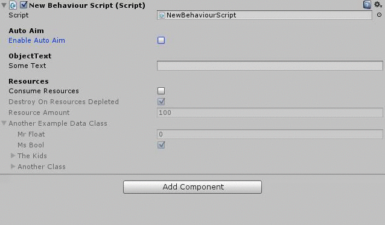
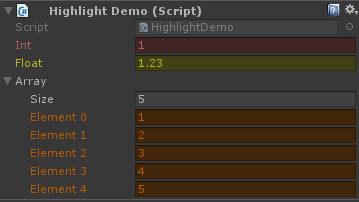

## Property Drawers!

This is a collection of links to lots of lovely property and decorator drawers from aound the internet that can make your Unity life much more pleasant.

## The Drawers

Name | Creator | Description | Image 
---|---|---|---
[Conditional Hide/Disable](http://www.brechtos.com/hiding-or-disabling-inspector-properties-using-propertydrawers-within-unity-5/) | [Brechtos](http://www.brechtos.com) | Hide or disable fields if other values evaluate to true/false | 
[Enum BitMask](https://github.com/prime31/UtilityKit/tree/master/Assets/UtilityKit) | [Prime31](https://github.com/prime31/) | Create a multi-elect dropdown from an Anum filed | 
[Highlight Basic](https://gist.github.com/fishtopher/f0caa8bd2c5cc5ed825c7c348dbe8908) | [Chris](https://github.com/fishtopher/) | Sets the text/background of a field to any colour.  | 
[Highlight](https://gist.github.com/fishtopher/f0caa8bd2c5cc5ed825c7c348dbe8908) | [Lotte](https://gist.github.com/LotteMakesStuff/) | Add some color to you inspectors! mark important property with a bright color so it always stands out, or supply a validation function so highlights show on values that would effect the current ingame logic! | 
[Min Max](https://gist.github.com/LotteMakesStuff/0de9be35044bab97cbe79b9ced695585) | [Lotte](https://gist.github.com/LotteMakesStuff/) | Draw a useful min/max setting slider.   |  
[Read Only](https://gist.github.com/LotteMakesStuff/c0a3b404524be57574ffa5f8270268ea) | [Lotte](https://gist.github.com/LotteMakesStuff/) | Add a StatsBar attribute to a property to make it draw a lil bar, really useful for visualizing character stats like Health or Mana.  | 
[Stats Bar](https://gist.github.com/LotteMakesStuff/b8853a16de3e680dc1c326fe6f5ebd7e) | [Lotte](https://gist.github.com/LotteMakesStuff/) | Make a field show up as read only in the inspector   |  
[Test Button](https://gist.github.com/LotteMakesStuff/dd785ff49b2a5048bb60333a6a125187) | [Lotte](https://gist.github.com/LotteMakesStuff/) | Make it super easy to trigger code via buttons in the inspector, and get feedback! |  
[Traffic Lights](https://gist.github.com/LotteMakesStuff/7fa131b0402ffb50a9e617c0d45ffa59) | [Lotte](https://gist.github.com/LotteMakesStuff/) | Draws lil Traffic Lights in the inspector. its really useful for visualizing state. For example, checkboxes can be hard to read at a glace, but a Red or Green status light is easy! Recommend you use the attached package, as it has all the icon image files.    |  
 

## About

### Contributing
If you have a lovely drawer that you'd like to share, send me the details, or if you're really into this github thing, submit a pull request with your addition(s).
If you want me to _remove_ something of yours from here, let me know that too and I'll do it!

#### Why isn't this an actual database or something
I wanted to see if it was a worthwhile project in the firstplace, and Github.io seemed like a good way to try out the MVP.

#### Contact
chris@vitei.com

